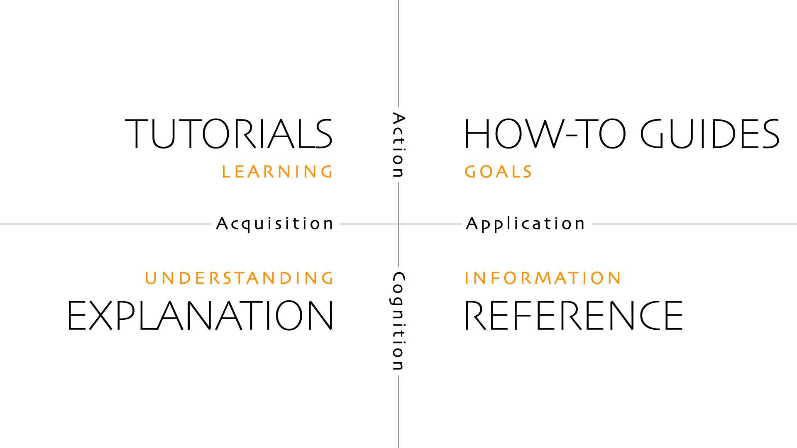

## Introduction

[Diátaxis](https://diataxis.fr) is a way of thinking about and doing documentation.

It prescribes approaches to content, architecture and form that emerge from a systematic approach to understanding the needs of documentation users.

Diátaxis identifies four distinct needs, and four corresponding forms of documentation - tutorials, how-to guides, technical reference and explanation. It places them in a systematic relationship, and proposes that documentation should itself be organised around the structures of those needs.

Diátaxis solves problems related to documentation content (what to write), style (how to write it) and architecture (how to organise it).

As well as serving the users of documentation, Diátaxis has value for documentation creators and maintainers. It is light-weight, easy to grasp and straightforward to apply. It doesn’t impose implementation constraints. It brings an active principle of quality to documentation that helps maintainers think effectively about their own work.

## The four kinds of documentation

The core idea of Diátaxis is that there are fundamentally four identifiable kinds of documentation, that respond to four different needs. The four kinds are:

- Tutorials
- How-to guides
- Reference
- Explanation

Each has a different purpose, and needs to be written in a different way.

### Tutorials

A tutorial is a lesson, that takes a student by the hand through a learning experience. A tutorial is always practical: the user does something, under the guidance of an instructor. A tutorial is designed around an encounter that the learner can make sense of, in which the instructor is responsible for the learner’s safety and success.

A driving lesson is a good example of a tutorial. The purpose of the lesson is to develop skills and confidence in the student, not to get from A to B. A software example could be: Let’s create a simple game in Python.

The user will learn through what they do - not because someone has tried to teach them.

In documentation, the special difficulty is that the instructor is condemned to be absent, and is not there to monitor the learner and correct their mistakes. The instructor must somehow find a way to be present through written instruction alone.

### How-to guides

A how-to guide addresses a real-world goal or problem, by providing practical directions to help the user who is in that situation.

A how-to guide always addresses an already-competent user, who is expected to be able to use the guide to help them get their work done. In contrast to a tutorial, a how-to guide is concerned with work rather than study.

A how-to guide might be: How to store cellulose nitrate film (in motion picture photography) or How to configure frame profiling (in software). Or even: Troubleshooting deployment problems.

### Reference

Reference guides contain the technical description - facts - that a user needs in order to do things correctly: accurate, complete, reliable information, free of distraction and interpretation. They contain propositional or theoretical knowledge, not guides to action.

Like a how-to guide, reference documentation serves the user who is at work, and it’s up to the user to be sufficiently competent to interpret and use it correctly.

Reference material is neutral. It is not concerned with what the user is doing. A marine chart could be used by a ship’s navigator to plot a course, but equally well by a prosecuting magistrate in a legal case.

Where possible, the architecture of reference documentation should reflect the structure or architecture of the thing it’s describing - just like a map does. If a method is part of a class that belongs to a certain module, then we should expect to see the same relationship in the documentation too.

### Explanation

Explanatory guides provide context and background. They serve the need to understand and put things in a bigger picture. Explanation joins things together, and helps answer the question why?

Explanation often needs to circle around its subject, and approach it from different directions. It can contain opinions and take perspectives.

Like reference, explanation belongs to the realm of propositional knowledge rather than action. However its purpose is to serve the user’s study - as tutorials do - and not their work.

Often, writers of tutorials who are anxious that their students should know things overload their tutorials with distracting and unhelpful explanation. It would be much more useful to give the learner the most minimal explanation (“Here, we use HTTPS because it’s safer”) and then link to an in-depth article (Secure communication using HTTPS encryption) for when the user is ready for it.
