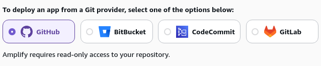
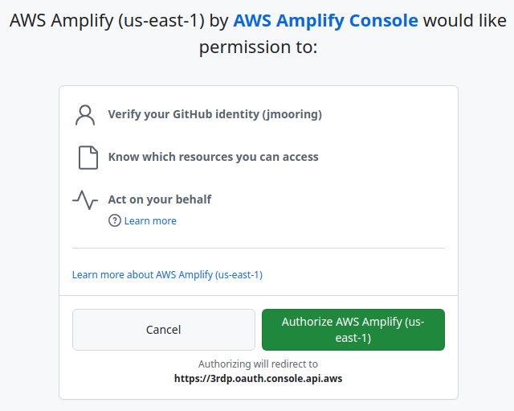
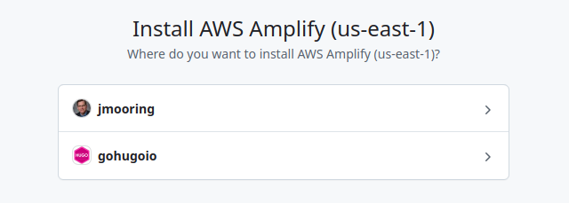

Use these instructions to enable continuous deployment from a GitHub repository. The same general steps apply if you are using GitLab for version control.

{}

## Prerequisites

Please complete the following tasks before continuing:

1. [Create](https://aws.amazon.com/resources/create-account/) an AWS account.
1. [Log in](https://console.aws.amazon.com/) to your AWS account.
1. [Create](https://github.com/signup) a GitHub account.
1. [Log in](https://github.com/login) to your GitHub account.
1. [Create](https://github.com/new) a GitHub repository for your project.
1. [Create](https://git-scm.com/docs/git-init) a local Git repository for your project with a [remote][] reference to your GitHub repository.
1. Create a Hugo project within your local Git repository and test it with the `hugo server` command.
1. Commit the changes to your local Git repository and push to your GitHub repository.

## Procedure

This procedure will enable continuous deployment from a GitHub repository. The procedure is essentially the same if you are using GitLab or Bitbucket.

Step 1
: Create a file named `amplify.yml` in the root of your project.

  ```sh
  touch amplify.yml
  ```

Step 2
: Copy and paste the YAML below into the file you created. Change the application versions and time zone as needed.

  ```yaml {file="amplify.yml" copy=true}
  version: 1
  env:
    variables:
      # Application versions
      DART_SASS_VERSION: 1.101.0
      GO_VERSION: 1.26.4
      HUGO_VERSION: 0.163.2
      NODE_VERSION: 24.16.0
      # Time zone
      TZ: America/Los_Angeles
      # Cache directories
      HUGO_CACHEDIR: ${PWD}/.cache/hugo
      NPM_CONFIG_CACHE: ${PWD}/.cache/npm
  frontend:
    phases:
      preBuild:
        commands:
          # Create directory for user-specific executable files
          - echo "Creating directory for user-specific executable files..."
          - mkdir -p "${HOME}/.local"

          # Install Dart Sass
          - echo "Installing Dart Sass ${DART_SASS_VERSION}..."
          - curl -sLO "https://github.com/sass/dart-sass/releases/download/${DART_SASS_VERSION}/dart-sass-${DART_SASS_VERSION}-linux-x64.tar.gz"
          - tar -C "${HOME}/.local" -xf "dart-sass-${DART_SASS_VERSION}-linux-x64.tar.gz"
          - rm "dart-sass-${DART_SASS_VERSION}-linux-x64.tar.gz"
          - export PATH="${HOME}/.local/dart-sass:${PATH}"

          # Install Go
          - echo "Installing Go ${GO_VERSION}..."
          - curl -sLO "https://go.dev/dl/go${GO_VERSION}.linux-amd64.tar.gz"
          - tar -C "${HOME}/.local" -xf "go${GO_VERSION}.linux-amd64.tar.gz"
          - rm "go${GO_VERSION}.linux-amd64.tar.gz"
          - export PATH="${HOME}/.local/go/bin:${PATH}"

          # Install Hugo
          - echo "Installing Hugo ${HUGO_VERSION}..."
          - curl -sLO "https://github.com/gohugoio/hugo/releases/download/v${HUGO_VERSION}/hugo_${HUGO_VERSION}_linux-amd64.tar.gz"
          - mkdir "${HOME}/.local/hugo"
          - tar -C "${HOME}/.local/hugo" -xf "hugo_${HUGO_VERSION}_linux-amd64.tar.gz"
          - rm "hugo_${HUGO_VERSION}_linux-amd64.tar.gz"
          - export PATH="${HOME}/.local/hugo:${PATH}"

          # Install Node.js
          - echo "Installing Node.js ${NODE_VERSION}..."
          - curl -sLO "https://nodejs.org/dist/v${NODE_VERSION}/node-v${NODE_VERSION}-linux-x64.tar.gz"
          - tar -C "${HOME}/.local" -xf "node-v${NODE_VERSION}-linux-x64.tar.gz"
          - rm "node-v${NODE_VERSION}-linux-x64.tar.gz"
          - export PATH="${HOME}/.local/node-v${NODE_VERSION}-linux-x64/bin:${PATH}"

          # Verify installations
          - echo "Verifying installations..."
          - "echo Dart Sass: $(sass --version)"
          - "echo Go: $(go version)"
          - "echo Hugo: $(hugo version)"
          - "echo Node.js: $(node --version)"

          # Install Node.js dependencies
          - if [ -f package-lock.json ]; then echo "Installing Node.js dependencies..." && npm ci --prefer-offline; fi

          # Configure Git
          - echo "Configuring Git..."
          - git config --global core.quotepath false
      build:
        commands:
          - echo "Building site..."
          - hugo build --gc --minify
    artifacts:
      baseDirectory: public
      files:
        - '**/*'
    cache:
      paths:
        - .cache/hugo/**/*
        - .cache/npm/**/*
  ```

Step 3
: In your project configuration, change the location of the image cache to the [`cacheDir`][] as shown below:

  
  [caches.images]
  dir = ':cacheDir/images'
  

  See [configure file caches][] for more information.

Step 4
: Commit and push the change to your GitHub repository.

  ```sh
  git add -A
  git commit -m "Create amplify.yml"
  git push
  ```

Step 5
: Log in to your AWS account, navigate to the [Amplify Console][], then press the  **Deploy an app** button.

Step 6
: Choose a source code provider, then press the **Next** button.

  

Step 7
: Authorize AWS Amplify to access your GitHub account.

  

Step 8
: Select your personal account or relevant organization.

  

Step 9
: Authorize access to one or more repositories.

  

Step 10
: Select a repository and branch, then press the **Next** button.

  

Step 11
: On the "App settings" page, scroll to the bottom then press the **Next** button. Amplify reads the `amplify.yml` file you created in Steps 1-3 instead of using the values on this page.

Step 12
: On the "Review" page, scroll to the bottom then press the **Save and deploy** button.

Step 13
: When your site has finished deploying, press the **Visit deployed URL** button to view your published site.

  

[Amplify Console]: https://console.aws.amazon.com/amplify/apps
[`cacheDir`]: /configuration/all/#cachedir
[configure file caches]: /configuration/caches/
[remote]: https://git-scm.com/docs/git-remote
