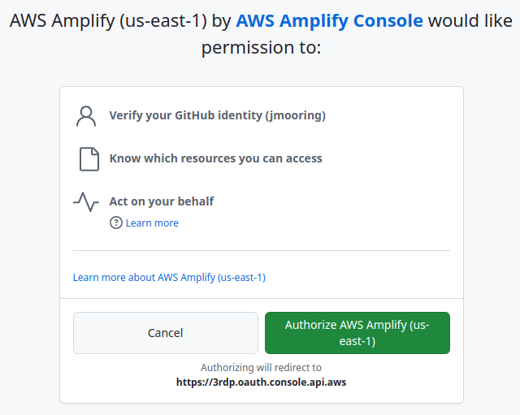
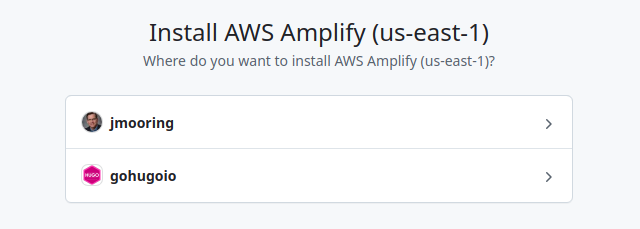
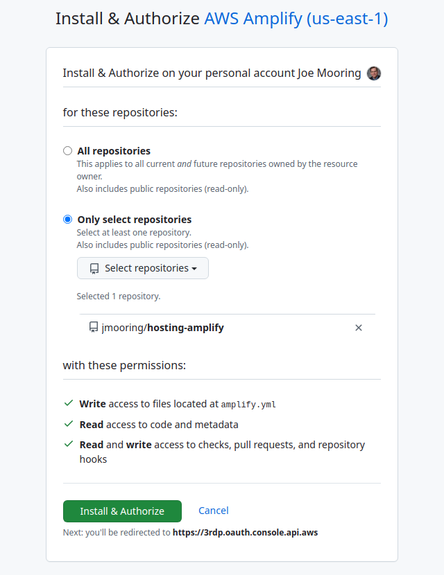
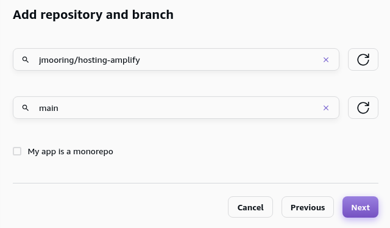
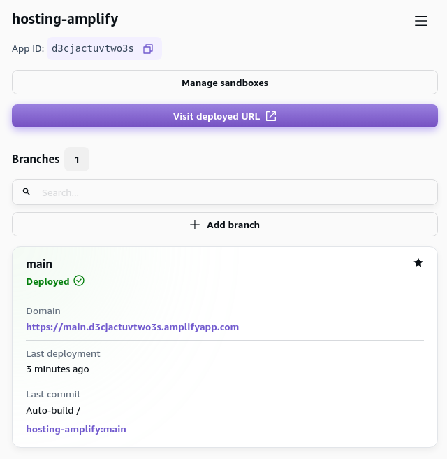

## Prerequisites

Please complete the following tasks before continuing:

1. [Create an AWS account]
1. [Install Git]
1. [Create a Hugo site] and test it locally with `hugo server`
1. Commit the changes to your local repository
1. Push the local repository to your [GitHub], [GitLab], or [Bitbucket] account

[Bitbucket]: https://bitbucket.org/product
[Create a Hugo site]: /getting-started/quick-start/
[Create an AWS account]: https://aws.amazon.com/resources/create-account/
[GitHub]: https://github.com
[GitLab]: https://about.gitlab.com/
[Install Git]: https://git-scm.com/book/en/v2/Getting-Started-Installing-Git

## Procedure

This procedure will enable continuous deployment from a GitHub repository. The procedure is essentially the same if you are using GitLab or Bitbucket.

### Step 1

Create a file named `amplify.yml` in the root of your project.

```sh
touch amplify.yml
```

### Step 2

Copy and paste the YAML below into the file you created. Change the application versions and time zone as needed.

```yaml {file="amplify.yml" copy=true}
version: 1
env:
  variables:
    # Application versions
    DART_SASS_VERSION: 1.89.2
    GO_VERSION: 1.24.2
    HUGO_VERSION: 0.147.9
    # Time zone
    TZ: America/Los_Angeles
    # Cache
    HUGO_CACHEDIR: ${PWD}/.hugo
    NPM_CONFIG_CACHE: ${PWD}/.npm
frontend:
  phases:
    preBuild:
      commands:
        # Install Dart Sass
        - curl -LJO https://github.com/sass/dart-sass/releases/download/${DART_SASS_VERSION}/dart-sass-${DART_SASS_VERSION}-linux-x64.tar.gz
        - sudo tar -C /usr/local/bin -xf dart-sass-${DART_SASS_VERSION}-linux-x64.tar.gz
        - rm dart-sass-${DART_SASS_VERSION}-linux-x64.tar.gz
        - export PATH=/usr/local/bin/dart-sass:$PATH

        # Install Go
        - curl -LJO https://go.dev/dl/go${GO_VERSION}.linux-amd64.tar.gz
        - sudo tar -C /usr/local -xf go${GO_VERSION}.linux-amd64.tar.gz
        - rm go${GO_VERSION}.linux-amd64.tar.gz
        - export PATH=/usr/local/go/bin:$PATH

        # Install Hugo
        - curl -LJO https://github.com/gohugoio/hugo/releases/download/v${HUGO_VERSION}/hugo_extended_${HUGO_VERSION}_linux-amd64.tar.gz
        - sudo tar -C /usr/local/bin -xf hugo_extended_${HUGO_VERSION}_linux-amd64.tar.gz
        - rm hugo_extended_${HUGO_VERSION}_linux-amd64.tar.gz
        - export PATH=/usr/local/bin:$PATH

        # Check installed versions
        - go version
        - hugo version
        - node -v
        - npm -v
        - sass --embedded --version

        # Install Node.JS dependencies
        - "[[ -f package-lock.json || -f npm-shrinkwrap.json ]] && npm ci --prefer-offline || true"

        # https://github.com/gohugoio/hugo/issues/9810
        - git config --add core.quotepath false
    build:
      commands:
        - hugo --gc --minify
  artifacts:
    baseDirectory: public
    files:
      - '**/*'
  cache:
    paths:
      - ${HUGO_CACHEDIR}/**/*
      - ${NPM_CONFIG_CACHE}/**/*
```

### Step 3

Commit and push the change to your GitHub repository.

```sh
git add -A
git commit -m "Create amplify.yml"
git push
```

### Step 4

Log in to your AWS account, navigate to the [Amplify Console], then press the  **Deploy an app** button.

[Amplify Console]: https://console.aws.amazon.com/amplify/apps

### Step 5

Choose a source code provider, then press the **Next** button.

  

### Step 6

Authorize AWS Amplify to access your GitHub account.

  

### Step 7

Select your personal account or relevant organization.

  

### Step 8

Authorize access to one or more repositories.

  

### Step 9

Select a repository and branch, then press the **Next** button.

  

### Step 10

On the "App settings" page, scroll to the bottom then press the **Next** button. Amplify reads the `amplify.yml` file you created in Steps 1-3 instead of using the values on this page.

### Step 11

On the "Review" page, scroll to the bottom then press the **Save and deploy** button.

### Step 12

When your site has finished deploying, press the **Visit deployed URL** button to view your published site.

  
