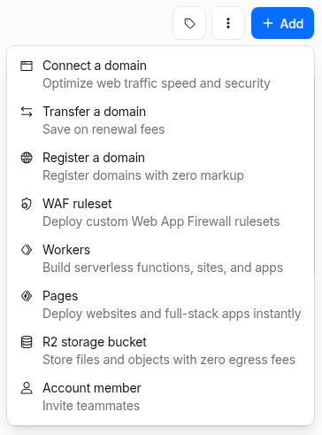
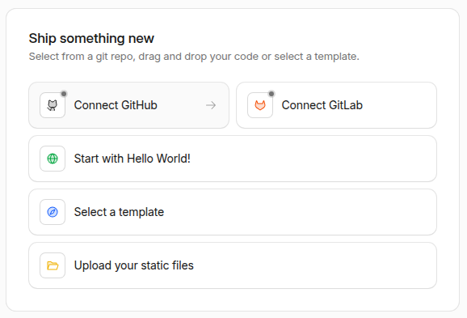

Use these instructions to enable continuous deployment from a GitHub repository. The same general steps apply if you are using GitLab for version control.

{}

## Prerequisites

Please complete the following tasks before continuing:

1. [Create](https://dash.cloudflare.com/sign-up) a Cloudflare account.
1. [Log in](https://dash.cloudflare.com/login) to your Cloudflare account.
1. [Create](https://github.com/signup) a GitHub account.
1. [Log in](https://github.com/login) to your GitHub account.
1. [Create](https://github.com/new) a GitHub repository for your project.
1. [Create](https://git-scm.com/docs/git-init) a local Git repository for your project with a [remote][] reference to your GitHub repository.
1. Create a Hugo project within your local Git repository and test it with the `hugo server` command.
1. Commit the changes to your local Git repository and push to your GitHub repository.

## Procedure

Step 1
: Create a `wrangler.jsonc` file in the root of your project. See [details][].

  ```jsonc {file="wrangler.jsonc" copy=true}
  {
    // Set this to the name of your project.
    "name": "test",
    // Set this to today's date in YYYY-MM-DD format.
    "compatibility_date": "2026-06-19",
    "build": {
      "command": "chmod a+x build.sh && ./build.sh"
    },
    "assets": {
      "directory": "./public",
      "not_found_handling": "404-page"
    }
  }
  ```

Step 2
: Create a `build.sh` file in the root of your project.

  ```sh {file="build.sh" copy=true}
  #!/usr/bin/env bash

  #------------------------------------------------------------------------------
  # @file
  # Builds a Hugo site hosted on a Cloudflare Worker.
  #------------------------------------------------------------------------------

  # Exit on error, undefined variables, or pipe failures
  set -euo pipefail

  build_temp_dir=""

  # Perform cleanup
  cleanup() {
    if [[ -n "${build_temp_dir}" && -d "${build_temp_dir}" ]]; then
      rm -rf "${build_temp_dir}"
    fi
  }

  # Register the cleanup trap
  trap cleanup EXIT SIGINT SIGTERM

  main() {
    # Define tool versions
    DART_SASS_VERSION=1.101.0
    GO_VERSION=1.26.4
    HUGO_VERSION=0.163.3
    NODE_VERSION=24.16.0

    # Set the build timezone
    export TZ=Europe/Oslo

    # Set the build cache directory
    export HUGO_CACHEDIR="${PWD}/.cache/hugo"

    # Create and move into a temporary directory for downloads
    build_temp_dir=$(mktemp -d)
    pushd "${build_temp_dir}" > /dev/null

    # Create the local tools directory
    mkdir -p "${HOME}/.local"

    # Install Dart Sass
    echo "Installing Dart Sass ${DART_SASS_VERSION}..."
    curl -sLO "https://github.com/sass/dart-sass/releases/download/${DART_SASS_VERSION}/dart-sass-${DART_SASS_VERSION}-linux-x64.tar.gz"
    tar -C "${HOME}/.local" -xf "dart-sass-${DART_SASS_VERSION}-linux-x64.tar.gz"
    export PATH="${HOME}/.local/dart-sass:${PATH}"

    # Install Go
    echo "Installing Go ${GO_VERSION}..."
    curl -sLO "https://go.dev/dl/go${GO_VERSION}.linux-amd64.tar.gz"
    tar -C "${HOME}/.local" -xf "go${GO_VERSION}.linux-amd64.tar.gz"
    export PATH="${HOME}/.local/go/bin:${PATH}"

    # Install Hugo
    echo "Installing Hugo ${HUGO_VERSION}..."
    curl -sLO "https://github.com/gohugoio/hugo/releases/download/v${HUGO_VERSION}/hugo_${HUGO_VERSION}_linux-amd64.tar.gz"
    mkdir -p "${HOME}/.local/hugo"
    tar -C "${HOME}/.local/hugo" -xf "hugo_${HUGO_VERSION}_linux-amd64.tar.gz"
    export PATH="${HOME}/.local/hugo:${PATH}"

    # Install Node.js
    echo "Installing Node.js ${NODE_VERSION}..."
    curl -sLO "https://nodejs.org/dist/v${NODE_VERSION}/node-v${NODE_VERSION}-linux-x64.tar.gz"
    tar -C "${HOME}/.local" -xf "node-v${NODE_VERSION}-linux-x64.tar.gz"
    export PATH="${HOME}/.local/node-v${NODE_VERSION}-linux-x64/bin:${PATH}"

    # Return to the project root
    popd > /dev/null

    # Verify installations
    echo "Verifying installations..."
    echo Dart Sass: "$(sass --version)"
    echo Go: "$(go version)"
    echo Hugo: "$(hugo version)"
    echo Node.js: "$(node --version)"

    # Configure Git
    echo "Configuring Git..."
    git config --global core.quotepath false
    if [ "$(git rev-parse --is-shallow-repository)" = "true" ]; then
      git fetch --unshallow
    fi

    # Install Node.js dependencies
    if [ -f package-lock.json ]; then
      echo "Installing Node.js dependencies..."
      npm ci
    fi

    # Build the site
    echo "Building the site..."
    hugo build --gc --minify
  }

  main "$@"
  ```

Step 3
: In your project configuration, change the location of the image cache to the [`cacheDir`][] as shown below:

  
  [caches.images]
  dir = ':cacheDir/images'
  

  See [configure file caches][] for more information.

Step 4
: Commit the changes to your local Git repository and push to your GitHub repository.

Step 5
: In the upper right corner of the Cloudflare [dashboard][], press the **Add** button and select "Workers" from the drop down menu.

  

Step 6
: Verify your account if prompted.

  

Step 7
: On the "Create a Worker" page, under the "Ship something new" heading, press the **Connect GitHub** button.

  

Step 8
: Select the GitHub account where you want to install the Cloudflare Workers and Pages application.

  

Step 9
: Authorize the Cloudflare Workers and Pages application to access all repositories or only select repositories, then press the **Install & Authorize** button.

  

Step 10
: On the "Create a Worker" page, under the "Select a repository" heading, select the repository to deploy, then press the **Next** button.

  

Step 11
: On the "Create a Worker" page, under the "Set up your application" heading, perform the following steps:

  1. Provide a **Project name**.
  1. Leave the **Build command** blank and ensure the **Deploy command** is `npx wrangler deploy`.
  1. Expand the **Advanced settings** panel.
  1. In the **Variable name** field, enter `SKIP_DEPENDENCY_INSTALL`.
  1. In the **Variable value** field, enter `true`.
  1. Press the **Deploy** button.

Step 12
: Wait for the site to build and deploy, then press the **Visit** button in the upper left corner of your screen.

  

In the future, whenever you push a change from your local Git repository, Cloudflare will rebuild and deploy your site.

## Build cache

The build script shown in [Step 2](#step-2) sets Hugo's [`cacheDir`][] to the path required by Cloudflare's build cache, which is disabled by default. To enable the Cloudflare build cache, you must complete two steps.

First, your project must have both a `package.json` and `package-lock.json` file in the project root. If you have only a package.json file, run `npm install` to create the corresponding `package-lock.json` file. If your project does not require any Node.js packages, create both files by running `npm init -y && npm install`.

Second, you must enable the build cache in your project dashboard.

1. Navigate to Workers & Pages Overview on the [dashboard][].
1. Find your Workers project.
1. Go to **Settings** > **Build** > **Build cache**.
1. Press the **Enable** button.

## Scheduled builds

If your site uses [`resources.GetRemote`][] to fetch external data at build time, that data is embedded in the static HTML when the site is built. Without a scheduled build, the data only refreshes when someone commits code to the repository. To keep content current, you can trigger a rebuild on a schedule by creating a Cloudflare deploy hook and calling it from a GitHub Actions workflow.

Step 1
: In the Cloudflare [dashboard][], go to **Workers & Pages**. Select your project, then navigate to **Settings** > **Builds** > **Deploy Hooks**. Press **Create deploy hook**, provide a name (e.g., `github-cron`), and copy the generated URL.

Step 2
: In your GitHub repository, go to **Settings** > **Secrets and variables** > **Actions**. Press **New repository secret**, name it `CLOUDFLARE_DEPLOY_HOOK`, paste the deploy hook URL as the value, and save.

Step 3
: Create a GitHub Actions workflow file in your repository.

  ```yaml {file=".github/workflows/scheduled-cloudflare-deploy.yml" copy=true}
  name: github-cron
  on:
    schedule:
      - cron: "42 7 * * *"
  jobs:
    deploy:
      runs-on: ubuntu-latest
      steps:
        - name: Trigger Cloudflare deploy hook
          run: curl -X POST "${{ secrets.CLOUDFLARE_DEPLOY_HOOK }}"
  ```

  Adjust the [`cron`][] expression to set your desired build schedule. In the example above, the job runs every day at 7:42 AM UTC.

Step 4
: Commit the changes to your local Git repository and push to your GitHub repository.

[`cacheDir`]: /configuration/all/#cachedir
[`resources.GetRemote`]: /functions/resources/getremote/
[configure file caches]: /configuration/caches/
[cron]: https://docs.github.com/en/actions/writing-workflows/choosing-when-your-workflow-runs/events-that-trigger-workflows#schedule
[dashboard]: https://dash.cloudflare.com/
[details]: https://developers.cloudflare.com/workers/wrangler/configuration/
[remote]: https://git-scm.com/docs/git-remote
