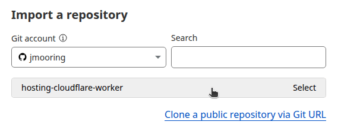
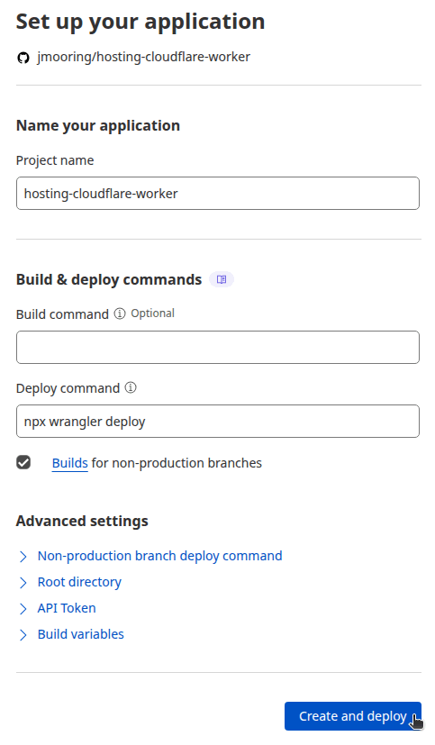

Use these instructions to enable continuous deployment from a GitHub repository. The same general steps apply if you are using GitLab for version control.

## Prerequisites

Please complete the following tasks before continuing:

1. [Create](https://dash.cloudflare.com/sign-up) a Cloudflare account
1. [Log in](https://dash.cloudflare.com/login) to your Cloudflare account
1. [Create](https://github.com/signup) a GitHub account
1. [Log in](https://github.com/login) to your GitHub account
1. [Create](https://github.com/new) a GitHub repository for your project
1. [Create](https://git-scm.com/docs/git-init) a local Git repository for your project with a [remote](https://git-scm.com/docs/git-remote) reference to your GitHub repository
1. Create a Hugo site within your local Git repository and test it with the `hugo server` command

## Procedure

Step 1
: Create a `wrangler.toml` file in the root of your project.

  ```toml {file="wrangler.toml" copy=true}
  name = "hosting-cloudflare-worker"
  compatibility_date = "2025-07-31"

  [build]
  command = "chmod a+x build.sh && ./build.sh"

  [assets]
  directory = "./public"
  not_found_handling = "404-page"
  ```

Step 2
: Create a `build.sh` file in the root of your project.

  ```sh {file="build.sh" copy=true}
  #!/usr/bin/env bash

  #------------------------------------------------------------------------------
  # @file
  # Builds a Hugo site hosted on a Cloudflare Worker.
  #
  # The Cloudflare Worker automatically installs Node.js dependencies.
  #------------------------------------------------------------------------------

  main() {

    DART_SASS_VERSION=1.93.2
    GO_VERSION=1.25.3
    HUGO_VERSION=0.152.2
    NODE_VERSION=22.20.0

    export TZ=Europe/Oslo

    # Install Dart Sass
    echo "Installing Dart Sass ${DART_SASS_VERSION}..."
    curl -sLJO "https://github.com/sass/dart-sass/releases/download/${DART_SASS_VERSION}/dart-sass-${DART_SASS_VERSION}-linux-x64.tar.gz"
    tar -C "${HOME}/.local" -xf "dart-sass-${DART_SASS_VERSION}-linux-x64.tar.gz"
    rm "dart-sass-${DART_SASS_VERSION}-linux-x64.tar.gz"
    export PATH="${HOME}/.local/dart-sass:${PATH}"

    # Install Go
    echo "Installing Go ${GO_VERSION}..."
    curl -sLJO "https://go.dev/dl/go${GO_VERSION}.linux-amd64.tar.gz"
    tar -C "${HOME}/.local" -xf "go${GO_VERSION}.linux-amd64.tar.gz"
    rm "go${GO_VERSION}.linux-amd64.tar.gz"
    export PATH="${HOME}/.local/go/bin:${PATH}"

    # Install Hugo
    echo "Installing Hugo ${HUGO_VERSION}..."
    curl -sLJO "https://github.com/gohugoio/hugo/releases/download/v${HUGO_VERSION}/hugo_extended_${HUGO_VERSION}_linux-amd64.tar.gz"
    mkdir "${HOME}/.local/hugo"
    tar -C "${HOME}/.local/hugo" -xf "hugo_extended_${HUGO_VERSION}_linux-amd64.tar.gz"
    rm "hugo_extended_${HUGO_VERSION}_linux-amd64.tar.gz"
    export PATH="${HOME}/.local/hugo:${PATH}"

    # Install Node.js
    echo "Installing Node.js ${NODE_VERSION}..."
    curl -sLJO "https://nodejs.org/dist/v${NODE_VERSION}/node-v${NODE_VERSION}-linux-x64.tar.xz"
    tar -C "${HOME}/.local" -xf "node-v${NODE_VERSION}-linux-x64.tar.xz"
    rm "node-v${NODE_VERSION}-linux-x64.tar.xz"
    export PATH="${HOME}/.local/node-v${NODE_VERSION}-linux-x64/bin:${PATH}"

    # Verify installations
    echo "Verifying installations..."
    echo Dart Sass: "$(sass --version)"
    echo Go: "$(go version)"
    echo Hugo: "$(hugo version)"
    echo Node.js: "$(node --version)"

    # Configure Git
    echo "Configuring Git..."
    git config core.quotepath false
    if [ "$(git rev-parse --is-shallow-repository)" = "true" ]; then
      git fetch --unshallow
    fi

    # Build the site
    echo "Building the site..."
    hugo --gc --minify

  }

  set -euo pipefail
  main "$@"
  ```

Step 3
: Commit the changes to your local Git repository and push to your GitHub repository.

Step 4
: In the upper right corner of the Cloudflare [dashboard](https://dash.cloudflare.com/), press the **Add** button and select "Workers" from the drop down menu.

  

Step 5
: On the "Workers" tab, press the **Get started** button to the right of the "Import a repository" item.

  

Step 6
: Connect to GitHub.

  

Step 7
: Select the GitHub account where you want to install the Cloudflare Workers and Pages application.

  

Step 8
: Authorize the Cloudflare Workers and Pages application to access all repositories or only select repositories, then press the **Install & Authorize** button.

  

  Your browser will be redirected to the Cloudflare dashboard.

Step 9
: On the "Workers" tab, press the **Get started** button to the right of the "Import a repository" item.

  

Step 10
: Select the repository to import.

  

Step 11
: On the "Set up your application" screen, provide a project name, leave the build command blank, then press the **Create and deploy** button.

  

Step 12
: Wait for the site to build and deploy, then visit your site.

  

In the future, whenever you push a change from your local Git repository, Cloudflare will rebuild and deploy your site.
