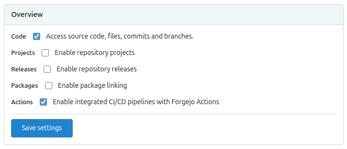
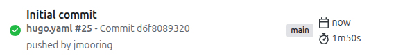
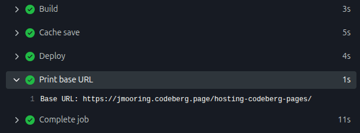

Use these instructions to enable continuous deployment from a Codeberg repository to Codeberg Pages.

{}

## Prerequisites

Please complete the following tasks before continuing:

1. [Create](https://codeberg.org/user/sign_up) a Codeberg account.
1. [Log in](https://codeberg.org/user/login) to your Codeberg account.
1. [Create](https://codeberg.org/repo/create) a Codeberg repository for your project.
1. [Create](https://git-scm.com/docs/git-init) a local Git repository for your project with a [remote][] reference to your Codeberg repository.
1. Create a Hugo project within your local Git repository and test it with the `hugo server` command.
1. Commit the changes to your local Git repository and push to your Codeberg repository.

## Procedure

Step 1
: Visit your Codeberg repository. Go to **Settings**&nbsp;>&nbsp;**Units**&nbsp;>&nbsp;**Overview**. Enable **Actions** and press the **Save Settings** button.

  

Step 2
: Create a `hugo.yaml` file in the `.forgejo/workflows` directory, adjusting the tool versions and time zone as needed.

  ```yaml {file=".forgejo/workflows/hugo.yaml" copy=true}
  name: Build and deploy
  on:
    push:
      branches:
        - main
    workflow_dispatch:
  concurrency:
    group: ${{ forgejo.workflow }}-${{ forgejo.ref }}
    cancel-in-progress: true
  jobs:
    build_and_deploy:
      name: Build and deploy
      runs-on: codeberg-small
      env:
        # Define tool versions
        DART_SASS_VERSION: 1.101.0
        GO_VERSION: 1.26.4
        HUGO_VERSION: 0.164.0
        NODE_VERSION: 24.18.0

        # Set the build time zone
        TZ: Europe/Oslo

        # Set the Hugo base URL
        HUGO_BASEURL: https://${{ forgejo.event.repository.owner.username }}.codeberg.page/${{ forgejo.event.repository.name }}/
      steps:
        - name: Checkout
          uses: actions/checkout@v7
          with:
            submodules: recursive
            fetch-depth: 0
            lfs: false

        - name: Create a local tools directory
          run: |
            mkdir -p "${HOME}/.local"

        - name: Install Dart Sass
          run: |
            echo "Installing Dart Sass ${DART_SASS_VERSION}..."
            curl -sfL --output-dir "${{ runner.temp }}" -O "https://github.com/sass/dart-sass/releases/download/${DART_SASS_VERSION}/dart-sass-${DART_SASS_VERSION}-linux-x64.tar.gz"
            tar -C "${HOME}/.local" -xf "${{ runner.temp }}/dart-sass-${DART_SASS_VERSION}-linux-x64.tar.gz"
            echo "${HOME}/.local/dart-sass" >> "${FORGEJO_PATH}"

        - name: Install Go
          run: |
            if [[ -f "go.mod" ]]; then
              echo "Installing Go ${GO_VERSION}..."
              curl -sfL --output-dir "${{ runner.temp }}" -O "https://go.dev/dl/go${GO_VERSION}.linux-amd64.tar.gz"
              tar -C "${HOME}/.local" -xf "${{ runner.temp }}/go${GO_VERSION}.linux-amd64.tar.gz"
              echo "${HOME}/.local/go/bin" >> "${FORGEJO_PATH}"
            fi

        - name: Install Hugo
          run: |
            echo "Installing Hugo ${HUGO_VERSION}..."
            curl -sfL --output-dir "${{ runner.temp }}" -O "https://github.com/gohugoio/hugo/releases/download/v${HUGO_VERSION}/hugo_${HUGO_VERSION}_linux-amd64.tar.gz"
            mkdir "${HOME}/.local/hugo"
            tar -C "${HOME}/.local/hugo" -xf "${{ runner.temp }}/hugo_${HUGO_VERSION}_linux-amd64.tar.gz"
            echo "${HOME}/.local/hugo" >> "${FORGEJO_PATH}"

        - name: Install Node.js
          run: |
            if [[ -f "package-lock.json" ]]; then
              echo "Installing Node.js ${NODE_VERSION}..."
              curl -sfL --output-dir "${{ runner.temp }}" -O "https://nodejs.org/dist/v${NODE_VERSION}/node-v${NODE_VERSION}-linux-x64.tar.gz"
              tar -C "${HOME}/.local" -xf "${{ runner.temp }}/node-v${NODE_VERSION}-linux-x64.tar.gz"
              echo "${HOME}/.local/node-v${NODE_VERSION}-linux-x64/bin" >> "${FORGEJO_PATH}"
            fi

        - name: Log tool versions
          run: |
            echo "Logging tool versions..."
            command -v sass &> /dev/null && echo "Dart Sass: $(sass --version)" || echo "Dart Sass: not installed"
            command -v go &> /dev/null && echo "Go: $(go version)" || echo "Go: not installed"
            command -v hugo &> /dev/null && echo "Hugo: $(hugo version)" || echo "Hugo: not installed"
            command -v node &> /dev/null && echo "Node.js: $(node --version)" || echo "Node.js: not installed"

        - name: Configure Git
          run: |
            echo "Configuring Git..."
            git config --global core.quotepath false

        - name: Fetch full Git history
          run: |
            if [[ $(git rev-parse --is-shallow-repository) == true ]]; then
              echo "Fetching full Git history..."
              git fetch --unshallow
            fi

        - name: Initialize Git submodules
          run: |
            if [[ -f .gitmodules ]]; then
              echo "Initializing Git submodules..."
              git submodule update --init --recursive
            fi

        - name: Install Node.js dependencies
          run: |
            if [[ -f package-lock.json ]]; then
              echo "Installing Node.js dependencies..."
              npm ci
            fi

        - name: Cache restore
          id: cache-restore
          uses: actions/cache/restore@v6
          with:
            path: ${{ runner.temp }}/hugo_cache
            key: hugo-${{ forgejo.run_id }}
            restore-keys: hugo-

        - name: Build
          run: |
            echo "Building the project..."
            hugo build \
              --gc \
              --minify \
              --cacheDir "${{ runner.temp }}/hugo_cache"

        - name: Cache save
          uses: actions/cache/save@v6
          with:
            path: ${{ runner.temp }}/hugo_cache
            key: ${{ steps.cache-restore.outputs.cache-primary-key }}

        - name: Deploy
          uses: actions/git-pages@v2
          with:
            site: ${{ env.HUGO_BASEURL }}
            token: ${{ forgejo.token }}
            source: public/

        - name: Print base URL
          run: |
            echo "Base URL: ${HUGO_BASEURL}"
  ```

Step 3
: In your project configuration, change the location of the image cache to the [`cacheDir`][] as shown below:

  
  [caches.images]
  dir = ':cacheDir/images'
  

  See [configure file caches][] for more information.

Step 4
: Commit the changes to your local Git repository and push to your Codeberg repository.

Step 5
: From Codeberg's main menu, choose **Actions**. You will see something like this:

  

Step 6
: When Codeberg has finished building and deploying your site, the color of the status indicator will change to green.

  

Step 7
: Click on the commit message as shown above. Under the "Print base URL" step, you will see a link to your live site.

  

In the future, whenever you push a change from your local Git repository, Codeberg Pages will rebuild and deploy your site.

## Base URL

Codeberg Pages site URLs take one of three forms:

Site type|URL|Notes
:--|:--|:--
Project site|`https://owner.codeberg.page/repo/`|Default; no workflow changes needed
User/organization site|`https://owner.codeberg.page/`|Repository must be named `pages`
Custom domain|`https://custom-domain.org/`|Requires additional workflow changes; see below

The `HUGO_BASEURL` environment variable in the example workflow targets a project site, automatically computing the URL from the repository owner's username and repository name. For other configurations, adjust the workflow as described below.

For a user/organization site, set `HUGO_BASEURL` to:

```text
https://${{ forgejo.event.repository.owner.username }}.codeberg.page/
```

For a custom domain, set `HUGO_BASEURL` to:

```text
https://custom-domain.org/
```

And add the `server` parameter to the Deploy step:

```yaml
- name: Deploy
  uses: actions/git-pages@v2
  with:
    site: ${{ env.HUGO_BASEURL }}
    server: codeberg.page
    token: ${{ forgejo.token }}
    source: public/
```

See the [Codeberg documentation][] for more information.

## Choosing a runner

Codeberg offers three [hosted runners][], each with a corresponding `-lazy` variant that may have longer queue times but helps balance load on shared infrastructure. The example workflow above uses `codeberg-small` for these reasons:

Runner|Notes
:--|:--
`codeberg-tiny`|The 2-minute maximum runtime is insufficient for image processing. Hugo caches processed images, but the initial run to prime that cache can exceed this limit.
`codeberg-small`|A reasonable middle ground for projects with a moderate amount of image processing. Queue times can exceed 30 minutes under heavy load. If your deployment is not time-sensitive, consider using `codeberg-small-lazy` instead.
`codeberg-medium`|Demand for these runners is high, making queue times impractical for routine deployments.

[Codeberg documentation]: https://docs.codeberg.org/codeberg-pages/forgejo-actions/
[`cacheDir`]: /configuration/all/#cachedir
[configure file caches]: /configuration/caches/
[hosted runners]: https://codeberg.org/actions/meta#available-runners
[remote]: https://git-scm.com/docs/git-remote
